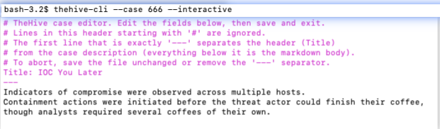
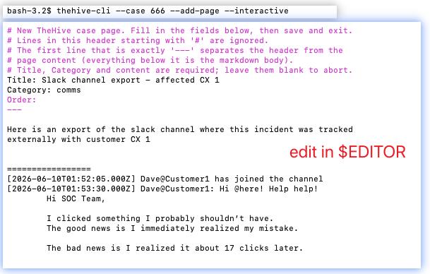
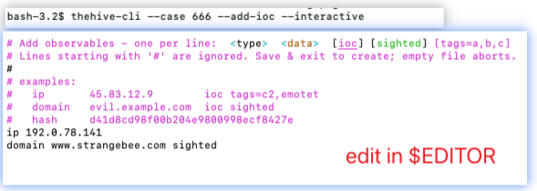
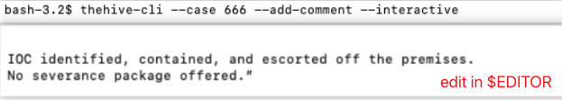
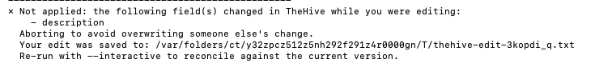

# thehive-cli - TheHive Command-Line Interface

A comprehensive command-line tool for interacting with TheHive security incident response platform.

> **TheHive** is a Security Incident Response Platform made by **StrangeBee** — you can find it at [strangebee.com](https://strangebee.com).
>
> **Not affiliated:** `thehive-cli` is an independent, unofficial project. It is **not associated with, endorsed by, or supported by StrangeBee or TheHive** in any way. It was built for fun, in the hope it helps out fellow DFIR and Blue team mates!. 🐝

## Features

- **Case Management**: List, search, view, and manage cases
- **Case Creation**: Create cases interactively (`$EDITOR`) or via flags, optionally from a template
- **Interactive editing**: Edit cases, pages, observables, comments, and timeline events in `$EDITOR`, with a **lost-update guard** that won't silently overwrite a concurrent change
- **Alert Management**: List and filter alerts
- **Comments**: View and add comments to cases
- **Attachments**: Add file attachments to cases
- **Pages**: List, create, and update case knowledge pages
- **Observables**: List and add observables (single, bulk, file, or an interactive IOC table)
- **Timeline**: List, add, update, and delete custom timeline events
- **History & Timeline**: View case activity history and live feeds
- **JSON Output**: Machine-readable JSON output for scripting and automation
- **Secure Credentials**: Store API credentials in system keychain
- **Shell Completion**: Tab completion support for Bash, Zsh, and Fish
- **Flexible Filtering**: Filter by status, user, title, description, and more

## Interactive editing

The standout feature: edit a case, page, observable, comment, or timeline event right in
your `$EDITOR` with `--interactive` (`-i`). `thehive-cli` downloads the current values, opens
them as a simple front-matter buffer, and on save sends **only the fields that changed** — no
clicking through the web UI, and complex/markdown content is as easy as writing a commit message.

A **lost-update guard** has your back: just before saving, it re-checks the case/page/event and
aborts (preserving your edit to a temp file) rather than overwriting a change someone else made
while your editor was open — useful because TheHive itself does last-write-wins with no locking.

<!--
  SCREENSHOTS — slot your images into the four spots below. Two ways:

  1. Easiest (web, no git): edit this README on github.com, delete the placeholder
     line for a shot, and drag-and-drop (or paste) the PNG straight into the editor
     text box. GitHub uploads it and inserts the image link for you.

  2. Portable (survives clones/mirrors): put the PNGs in a `screenshots/` folder in
     the repo and keep the relative links below (rename your files to match, or edit
     the paths). Capture at a readable width; if a shot is very wide, swap the
     markdown for an  tag to cap it, e.g.:
         
-->

### Editing a case — `thehive-cli --case 666 -i`


### Creating/editing a page — `thehive-cli --case 666 --add-page -i`



### Adding observables (the IOC table) — `thehive-cli --case 666 --add-observable -i`



### Composing a comment — `thehive-cli --case 666 --add-comment -i`



### Concurrent-edit protection — the lost-update guard

If someone changes the same field while your editor is open, the save is aborted instead of
silently overwriting their work (your edit is preserved to a temp file):



## Quick Start

### Installation

```bash
# Install required dependencies
pip install thehive4py keyring

# Optional: Install shtab for shell tab completion
pip install shtab
```

### Initial Setup

```bash
# Store your TheHive credentials in keychain (one-time setup)
./thehive-cli --store-key
```

You'll be prompted to enter:
- TheHive URL (e.g., http://192.168.1.100:9000)
- API Key

### Managing Credentials

```bash
# View currently stored credentials (API key is masked)
./thehive-cli --show-credentials

# Update credentials (re-prompts for URL and API key)
./thehive-cli --store-key

# Override stored credentials for a single command
./thehive-cli --url http://other-host:9000 --api-key YOUR_KEY --list-cases
```

### Basic Usage

```bash
# List all cases
./thehive-cli --list-cases

# Get specific case details  (-t / --ticket are short aliases for --case)
./thehive-cli --case 123

# View case with comments and history
./thehive-cli --case 123 --comments --history

# Add a comment to a case
./thehive-cli --case 123 --add-comment "Investigation complete"

# Attach a file to a case
./thehive-cli --case 123 --add-attachment evidence.pdf

# Attach a file with a UTC timestamp prepended to its name
./thehive-cli --case 123 --add-attachment evidence.pdf --timestamp-attachment

# List all alerts
./thehive-cli --list-alerts

# View live feed (recent activity)
./thehive-cli --live-feed 20
```

## Command Reference

### Case Operations

| Option | Description |
|--------|-------------|
| `-t, --ticket, --case NUM` | Specify case number |
| `--list-cases` | List all cases (alias: `--list-all`) |
| `--status STATUS` | Filter by status (New, InProgress, Resolved, Closed) |
| `--title TEXT` | Search by title (supports wildcards: `*phish*`) |
| `--createdby EMAIL` | Filter by creator |
| `--showdescription` | Show full case descriptions |
| `--update-case` | Update a case's title/description (requires `-t`; use `--interactive`, or `--case-title`/`--case-description`). Alias: `--case-update` |

### Creating Cases

| Option | Description |
|--------|-------------|
| `--create-case` | Create a new case (with `--interactive`, or `--case-title`/`--case-description`) |
| `--case-title TEXT` | Title for the new case |
| `--case-description TEXT` | Description for the new case (use `-` for stdin) |
| `--case-template NAME` | Optional: apply a case template by name at creation |
| `--list-case-templates` | List available case templates |
| `--interactive`, `-i` | With `--create-case`: fill in title/description in `$EDITOR` |

### Alert Operations

| Option | Description |
|--------|-------------|
| `--list-alerts` | List all alerts |
| `--alert-status STATUS` | Filter alerts (New, Imported, Ignored) |

### Case Details

| Option | Description |
|--------|-------------|
| `--comments`, `--list-comments` | Show case comments |
| `--history`, `--list-history` | Show case activity history |
| `--case-live-feed` | Show live feed for specific case |
| `--list-observables` | List all observables for a case (full detail) |
| `--download-attachment [ID]` | Download a case attachment by ID (omit the ID to list attachments + IDs); save path via `--output-file` |
| `--export-case` | Export the case to an encrypted `.thar` archive (`--export-password` or prompt; path via `--output-file`) |
| `--export-misp MISP_SERVER` | Export the case to a configured MISP server by name |

### Modifications

| Option | Description |
|--------|-------------|
| `--add-comment [TEXT]` | Add comment. Pass text, `-` for stdin, or omit the text to compose in `$EDITOR` (markdown) |
| `--add-attachment [FILE]` | Attach file to case. Pass a directory to pick a file from inside it, or omit the path to pick from the current directory (fzf, else a TAB-completing prompt / browser) |
| `--attachment-name NAME` | Store the attachment under this name instead of its original filename |
| `--attachment-sort {name,mtime,size}` | Sort order for the file picker (default: `mtime`, newest first) |
| `--attachment-sort-reverse` | Reverse the picker sort (oldest/smallest first, or Z→A) |
| `--timestamp-attachment` | Prepend UTC timestamp (`YYYYmmDD_HHMMSS_`) to attachment filename (use with `--add-attachment`) |

### Report Templates

| Option | Description |
|--------|-------------|
| `--list-report-templates` | List all available report templates |
| `--render-report TEMPLATE` | Render case report using template |
| `--output-file FILE` | Output file for rendered report |

### Pages

| Option | Description |
|--------|-------------|
| `--list-pages` | List all pages for a case (requires `-t`) |
| `--add-page` | Create a page (`--page-title`/`--page-content`/`--page-category`, or `--interactive` to compose in `$EDITOR`) |
| `--update-page PAGE_ID` | Update a case page by ID (any subset of `--page-*` fields) |
| `--page-title TEXT` | Page title (used with `--add-page`/`--update-page`) |
| `--page-content TEXT` | Page content/markdown (use `-` for stdin) |
| `--page-category TEXT` | Page category |
| `--page-order N` | Page display order (optional integer) |
| `--interactive`, `-i` | Edit in `$EDITOR`, then apply only changed fields: the **case** (title/description) with just `-t`, a **page** with `--update-page`, a **timeline event** with `--update-event`; or fills in `--create-case`/`--add-page`/`--add-observable`/`--add-event`/`--add-comment` |

### Observables

| Option | Description |
|--------|-------------|
| `--list-observables` | List all observables for a case (requires `-t`) |
| `--add-observable` | Add observable(s) (requires `-t`); use `--interactive` for a line-based IOC table |
| `--add-ioc` | Same as `--add-observable`, but flags everything it adds as an IOC (`ioc=true`) |
| `--obs-type TYPE` | dataType, e.g. `ip`, `domain`, `hash`, `url` |
| `--obs-data VALUE` | Value; comma-separated for several, or `-` to read one-per-line from stdin |
| `--obs-file PATH` | Create a file observable from this path |
| `--obs-ioc` / `--obs-sighted` | Mark as IOC / sighted |
| `--obs-tags a,b` / `--obs-tlp N` / `--obs-message TEXT` | Tags / TLP / note |

### Timeline Events

| Option | Description |
|--------|-------------|
| `--list-events` | List custom timeline events (with IDs) for a case (requires `-t`) |
| `--add-event` | Add a custom event (requires `-t`); use `--interactive` or `--event-*` flags |
| `--update-event EVENT_ID` | Update a custom event (any subset of `--event-*`, or `--interactive`) |
| `--delete-event EVENT_ID` | Delete a custom event |
| `--event-title TEXT` | Event title |
| `--event-date WHEN` | `YYYY-MM-DD HH:MM[:SS]` (local) or epoch-ms; defaults to now on `--add-event` |
| `--event-end WHEN` | Optional end date (makes it a span) |
| `--event-description TEXT` | Description/markdown (use `-` for stdin) |

### Tasks

| Option | Description |
|--------|-------------|
| `--list-tasks` | List tasks for a case (requires `-t`) |
| `--add-task` | Add a task (requires `-t`); use `--task-title` (+ `--task-description`/`--task-group`), or `--interactive` |
| `--add-task-log TASK_ID` | Add a work-log entry to a task; message via `--task-log-message`, `-` for stdin, or `--interactive`/`$EDITOR` |
| `--task-title TEXT` | Task title |
| `--task-description TEXT` | Task description (use `-` for stdin) |
| `--task-group TEXT` | Task group |
| `--task-log-message TEXT` | Task log message (use `-` for stdin) |

### Live Feed

| Option | Description |
|--------|-------------|
| `--live-feed N` | Show N recent activities (alerts & cases) |

### Authentication

| Option | Description |
|--------|-------------|
| `--store-key` | Store/update credentials in keychain, prompting for URL and API key (aliases: `--store-credentials`, `--set-api-key`, `--login`) |
| `--whoami` | Show the current API user (login, organisation, profile) — also a quick credential check |
| `--show-credentials` | Display currently stored keychain credentials (API key is masked) |
| `--api-key KEY` | Provide API key via command line (overrides keychain) |
| `--url URL` | Provide TheHive URL via command line (overrides keychain) |

### Output Format

| Option | Description |
|--------|-------------|
| `--json` | Output results as JSON (suppresses decorative text and clipboard) |

### Other

| Option | Description |
|--------|-------------|
| `--version, -v` | Show version |
| `--DEBUG` | Enable debug output |
| `--print-completion SHELL` | Generate shell completion script |

## Examples

### Creating a Case

```bash
# Create a case interactively (title + description in $EDITOR)
./thehive-cli --create-case --interactive

# Create from the command line
./thehive-cli --create-case --case-title "Phishing report" --case-description "User forwarded a suspicious email"

# Read the description (markdown) from a file via stdin
./thehive-cli --create-case --case-title "IR-2026-014" --case-description - < incident.md

# Apply a case template by name (expands its tasks, custom fields, severity, etc.)
./thehive-cli --create-case --interactive --case-template "Phishing"

# Discover available template names
./thehive-cli --list-case-templates
./thehive-cli --list-case-templates --json | jq '.templates[].name'
```

> Case templates can also be applied **after** creation in TheHive, so supplying `--case-template` at creation time is optional.

### Search and Filter

```bash
# Find all new cases
./thehive-cli --list-cases --status new

# Search for phishing cases
./thehive-cli --list-cases --title phishing

# Find cases created by specific user
./thehive-cli --list-cases --createdby admin@example.com

# Combine filters
./thehive-cli --list-cases --status new --title malware
```

### Case Management

```bash
# View case details with full description
./thehive-cli --case 456 --showdescription

# Edit the case title/description interactively in $EDITOR (applies only if changed)
./thehive-cli --case 456 --interactive
./thehive-cli --case 456 --update-case --interactive          # explicit form (alias: --case-update)

# Update a case non-interactively
./thehive-cli --case 456 --update-case --case-title "Escalated: BEC attempt"
./thehive-cli --case 456 --update-case --case-description - < incident-notes.md

# View case with comments and history
./thehive-cli --case 456 --comments --history

# Add comment from command line
./thehive-cli --case 456 --add-comment "Escalating to tier 2"

# Compose a comment in $EDITOR (no text given) - great for long/markdown comments
./thehive-cli --case 456 --add-comment

# Open $EDITOR pre-filled with a draft to expand on
./thehive-cli --case 456 --add-comment "initial findings:" --interactive

# Add comment from file
./thehive-cli --case 456 --add-comment - < analysis.txt

# Add comment from stdin
echo "Case closed - false positive" | ./thehive-cli --case 456 --add-comment -
```

### Attachments

```bash
# Attach single file
./thehive-cli --case 789 --add-attachment screenshot.png

# Pick a file interactively (no path): uses fzf if installed, otherwise a
# TAB-completing prompt (press Enter at the prompt to browse a numbered menu).
# After picking, you're prompted for the upload name (pre-filled, editable).
./thehive-cli --case 789 --add-attachment

# Pick a file from inside a specific directory
./thehive-cli --case 789 --add-attachment ~/Downloads
# The picker lists files newest-first by default (handy for ~/Downloads).
# Change it with --attachment-sort name|mtime|size (+ --attachment-sort-reverse):
./thehive-cli --case 789 --add-attachment ~/Downloads --attachment-sort name
./thehive-cli --case 789 --add-attachment ~/Downloads --attachment-sort size

# Upload under a different name than the file on disk
./thehive-cli --case 789 --add-attachment screenshot.png --attachment-name "case789_evidence.png"

# Rename + timestamp compose (uploads as e.g. 20260311_143022_case789_evidence.png)
./thehive-cli --case 789 --add-attachment screenshot.png --attachment-name "case789_evidence.png" --timestamp-attachment

# Attach file with UTC timestamp prepended to filename
./thehive-cli --case 789 --add-attachment screenshot.png --timestamp-attachment
# uploads as e.g. 20260311_143022_screenshot.png

# Attach file with comment
./thehive-cli --case 789 --add-attachment report.pdf --add-comment "See attached report"

# Attach file with timestamp and comment
./thehive-cli --case 789 --add-attachment report.pdf --timestamp-attachment --add-comment "See attached report"
```

### Report Generation

```bash
# List all available report templates
./thehive-cli --list-report-templates

# Render case report using template (output to stdout)
./thehive-cli --case 123 --render-report "Default Template"

# Render case report and save to file
./thehive-cli --case 123 --render-report template_id --output-file case_report.html

# Render report with specific template name
./thehive-cli --case 456 --render-report "Incident Report" --output-file incident_456.html
```

### Observables

```bash
# List all observables for a case
./thehive-cli --case 123 --list-observables

# As JSON (includes IOC flag, TLP, PAP, tags, message, timestamps)
./thehive-cli --case 123 --list-observables --json

# Filter with jq — e.g. all IOC observables
./thehive-cli --case 123 --list-observables --json | jq '.observables[] | select(.ioc == true)'

# Extract all IP addresses
./thehive-cli --case 123 --list-observables --json | jq '.observables[] | select(.dataType == "ip") | .data'
```

### Pages

```bash
# List all pages for a case
./thehive-cli --case 123 --list-pages

# As JSON (includes full page content)
./thehive-cli --case 123 --list-pages --json

# Create a page (title, content, and category are all required)
./thehive-cli --case 123 --add-page --page-title "Runbook" --page-content "## Steps" --page-category "Notes"

# Create a page, reading the markdown content from a file via stdin
./thehive-cli --case 123 --add-page --page-title "Runbook" --page-content - --page-category "Notes" < runbook.md

# Compose a new page in $EDITOR (Title/Category/Order header, then the markdown body);
# any --page-* fields you pass pre-fill the buffer
./thehive-cli --case 123 --add-page --interactive
./thehive-cli --case 123 --add-page --page-category "Notes" --interactive

# Update an existing page (only the fields you pass are changed)
./thehive-cli --case 123 --update-page '~1234' --page-content "Updated body text"
./thehive-cli --case 123 --update-page '~1234' --page-title "New title" --page-order 2

# Edit a page interactively in $EDITOR (downloads current values, applies only if changed)
./thehive-cli --case 123 --update-page '~1234' --interactive
```

> **Note:** Page IDs begin with `~`, so quote them in the shell (e.g. `'~1234'`) to avoid tilde expansion. Get a page's ID from `--list-pages --json`.

#### Interactive editing

> 📸 See it in action in [Interactive editing](#interactive-editing) near the top of this README.

With `--update-page ... --interactive`, the tool fetches the page's current `title`, `category`, `order`, and `content`, then opens them in your editor (`$EDITOR`, falling back to `$VISUAL`, then `vi`). The buffer uses a front-matter layout — header fields, then a `---` separator, then the markdown body:

```
Title: Runbook
Category: Notes
Order: 1
---
## Steps
1. ...
```

Save and exit to apply; the tool sends **only** the fields that actually changed. If you save the file unchanged (or remove the `---` separator), no update is sent. Not intended for use with `--json`/automation.

The same mechanism edits a **case** when you use `--interactive` with just `-t` (no `--update-page`): the buffer exposes `Title:` in the header and the case **description** as the markdown body. Only the title and description are editable this way. The explicit form is `--update-case --interactive` (alias `--case-update`), which also supports a non-interactive update via `--case-title`/`--case-description`.

### Adding Observables

> 📸 The interactive IOC table is shown in [Interactive editing](#interactive-editing) near the top of this README.

```bash
# Single observable, flagged as an IOC, with tags
./thehive-cli --case 123 --add-observable --obs-type ip --obs-data 45.83.12.9 --obs-ioc --obs-tags c2,emotet

# --add-ioc is a shortcut that flags everything as an IOC (no need for --obs-ioc)
./thehive-cli --case 123 --add-ioc --obs-type ip --obs-data - < ips.txt        # all marked ioc=true
./thehive-cli --case 123 --add-ioc --interactive                                # IOC table; every row is an IOC

# Several of the same type at once (comma-separated)
./thehive-cli --case 123 --add-observable --obs-type domain --obs-data "a.com,b.com,c.com" --obs-ioc

# Bulk from a file, one value per line, via stdin
./thehive-cli --case 123 --add-observable --obs-type ip --obs-data - < ips.txt

# A file observable
./thehive-cli --case 123 --add-observable --obs-file /path/malware.bin --obs-message "dropper"

# Interactive: paste a line-based IOC table into $EDITOR
./thehive-cli --case 123 --add-observable --interactive
```

The interactive table is one observable per line — `<type>  <data>  [ioc] [sighted] [tags=a,b,c]` — with `#` comment lines:

```
ip       45.83.12.9        ioc tags=c2,emotet
domain   evil.example.com  ioc sighted
hash     d41d8cd98f00b204e9800998ecf8427e
```

### Timeline Events

The case **timeline** itself is read-only (auto-derived; see `--history`), but you can manage **custom events** on it:

```bash
# List custom events (shows the IDs needed for update/delete)
./thehive-cli --case 123 --list-events
./thehive-cli --case 123 --list-events --json

# Add an event (date defaults to now if omitted)
./thehive-cli --case 123 --add-event --event-title "Containment started" --event-date "2026-06-09 14:30"

# Add a span event (start + end)
./thehive-cli --case 123 --add-event --event-title "Breach window" --event-date "2026-06-01 09:00" --event-end "2026-06-03 17:00"

# Add or edit interactively in $EDITOR (Title/Date/EndDate header, description body)
./thehive-cli --case 123 --add-event --interactive
./thehive-cli --case 123 --update-event '~1234' --interactive

# Update specific fields, or delete
./thehive-cli --case 123 --update-event '~1234' --event-title "Containment complete"
./thehive-cli --case 123 --delete-event '~1234'
```

> Dates accept `YYYY-MM-DD HH:MM[:SS]` (local time) or raw epoch-ms. Event IDs start with `~`, so quote them in the shell.

### Tasks

```bash
# List a case's tasks (with IDs)
./thehive-cli --case 123 --list-tasks
./thehive-cli --case 123 --list-tasks --json | jq '.tasks[] | {id: ._id, title, status}'

# Add a task (or compose it in $EDITOR)
./thehive-cli --case 123 --add-task --task-title "Collect logs" --task-group forensics
./thehive-cli --case 123 --add-task --interactive

# Add a work-log entry to a task (by its ID); compose in $EDITOR or pass text/stdin
./thehive-cli --case 123 --add-task-log '~1234' --interactive
./thehive-cli --case 123 --add-task-log '~1234' --task-log-message "Pulled EDR + proxy logs"
./thehive-cli --case 123 --add-task-log '~1234' --task-log-message - < notes.md
```

### Attachments, Export & Account

```bash
# List a case's attachments and their IDs, then download one
./thehive-cli --case 123 --download-attachment
./thehive-cli --case 123 --download-attachment '~5678' --output-file evidence.pdf

# Export a case to an encrypted .thar archive (prompts for a password if --export-password omitted)
./thehive-cli --case 123 --export-case --output-file case123.thar

# Export a case to a configured MISP server (by its connector name in TheHive)
./thehive-cli --case 123 --export-misp "MyMISP"

# Show the current API user (handy credential/connectivity check)
./thehive-cli --whoami
./thehive-cli --whoami --json
```

### Alerts

```bash
# List all alerts
./thehive-cli --list-alerts

# List only new alerts
./thehive-cli --list-alerts --alert-status New

# Search alerts by title
./thehive-cli --list-alerts --title "suspicious email"
```

### Live Feeds

```bash
# Show 30 most recent activities
./thehive-cli --live-feed 30

# Show live feed for specific case
./thehive-cli --case 123 --case-live-feed
```

### JSON Output

Add `--json` to any command to get machine-readable output. All decorative text and clipboard writes are suppressed.

```bash
# List all cases as JSON
./thehive-cli --list-cases --json | python3 -m json.tool

# Get case details as JSON (includes observables)
./thehive-cli --case 123 --json

# Get case with history, comments, and live feed in one JSON object
./thehive-cli --case 123 --history --comments --case-live-feed --json

# List alerts as JSON
./thehive-cli --list-alerts --json

# Live feed as JSON
./thehive-cli --live-feed 20 --json

# List report templates as JSON
./thehive-cli --list-report-templates --json

# Add comment and get JSON result (exit code reflects success/failure)
./thehive-cli --case 123 --add-comment "Investigation complete" --json

# Pipe JSON output into jq for further processing
./thehive-cli --list-cases --status new --json | jq '.cases[].title'
./thehive-cli --case 123 --json | jq '.case.observables'
```

#### JSON Output Shapes

| Mode | Top-level keys |
|------|---------------|
| `--list-cases` | `mode`, `filters`, `count`, `cases[]` |
| `--create-case` | `success`, `action`, `case_id`, `number`, `title`, `url`, optional `caseTemplate` |
| `--list-case-templates` | `mode`, `count`, `templates[]` |
| `--list-alerts` | `mode`, `count`, `alerts[]` |
| `--ticket` | `mode`, `case{}`, optional: `history[]`, `comments[]`, `live_feed[]` |
| `--list-observables` | `mode`, `case_number`, `case_id`, `count`, `observables[]` |
| `--add-observable` | `success`, `action`, `case_id`, `created_count`, `created[]`, optional `errors[]` |
| `--list-events` | `mode`, `case_number`, `case_id`, `count`, `events[]` |
| `--add-event` / `--update-event` / `--delete-event` | `success`, `action`, `event_id`, + mode-specific fields |
| `--list-tasks` | `mode`, `case_number`, `case_id`, `count`, `tasks[]` |
| `--add-task` / `--add-task-log` | `success`, `action`, `case_id`/`task_id`, + mode-specific fields |
| `--download-attachment` (bare) | `mode`, `case_number`, `case_id`, `count`, `attachments[]` |
| `--download-attachment ID` / `--export-case` | `success`, `action`, `case_id`, `output_file`, `size` |
| `--export-misp` | `success`, `action`, `case_id`, `number`, `misp_server` |
| `--whoami` | `mode`, `login`, `name`, `organisation`, `profile`, `type`, `permissions[]` |
| `--list-pages` | `mode`, `case_number`, `case_id`, `count`, `pages[]` |
| `--live-feed` | `mode`, `limit`, `count`, `activities[]` |
| `--case-live-feed` | `mode`, `case_number`, `count`, `activities[]` |
| `--history` | `mode`, `case_id`, `count`, `entries[]` |
| `--comments` | `mode`, `case_id`, `count`, `comments[]` |
| `--list-report-templates` | `mode`, `count`, `templates[]` |
| `--add-comment` / `--add-attachment` / `--render-report` / `--add-page` / `--update-page` | `success`, `action`, `case_id`, + mode-specific fields |

Each observable object includes: `_id`, `dataType`, `data`, `ioc`, `sighted`, `tlp`, `pap`, `tags`, `message`, `created_at`, `created_by`, and optionally `sighted_at`, `ignore_similarity`, `attachment{name, size, contentType}`.

Each page object includes: `_id`, `title`, `category`, `order`, `content`, `created_at`, `created_by`, and optionally `updated_at`, `updated_by`.

## Shell Completion

Install tab completion for your shell:

```bash
# Bash
./thehive-cli --print-completion bash > ~/.local/share/bash-completion/completions/thehive-cli

# Zsh
./thehive-cli --print-completion zsh > ~/.zsh/completion/_thehive-cli

# Fish
./thehive-cli --print-completion fish > ~/.config/fish/completions/thehive-cli.fish
```

See [SHELL_COMPLETION.md](SHELL_COMPLETION.md) for detailed instructions.

Completion includes **filename completion** for the file-path options (`--add-attachment`, `--obs-file`, `--output-file`), so `--add-attachment <TAB>` lists files. Regenerate the completion script after upgrading to pick this up.

## Requirements

- Python 3.7+
- thehive4py
- keyring
- shtab (optional, for shell completion)
- fzf (optional, for the interactive `--add-attachment` file picker — falls back to a built-in prompt/browser if absent)

## Documentation

- [CHANGES.md](CHANGES.md) - Version history and changelog
- [SHELL_COMPLETION.md](SHELL_COMPLETION.md) - Shell completion setup guide

## License

This tool is provided as-is for use with TheHive security incident response platform.
